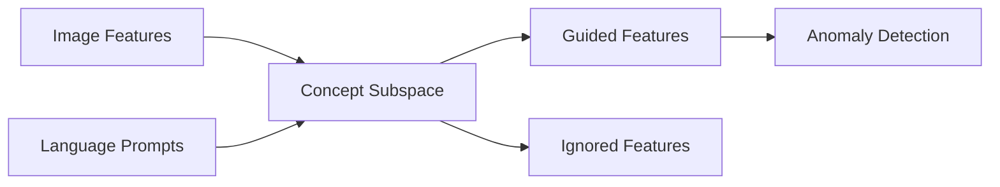

## What is LAFT?

LAFT (Language-Assisted Feature Transformation) is a novel approach to anomaly detection that leverages language guidance to transform visual features in semantically meaningful ways. Presented at ICLR 2025, LAFT enables more accurate and interpretable anomaly detection by allowing users to specify which semantic concepts should guide the detection process.

<Note>
LAFT was accepted at the **Thirteenth International Conference on Learning Representations (ICLR 2025)**.

[Read the paper](https://arxiv.org/abs/2503.01184) | [OpenReview](https://openreview.net/forum?id=2p03KljxE9)
</Note>

## The Core Problem

Traditional anomaly detection methods struggle with semantic anomalies where:
- **Visual features alone are insufficient** - Anomalies may be semantically meaningful but visually subtle
- **Domain knowledge is hard to incorporate** - Existing methods don't allow users to specify what makes something anomalous
- **Spurious correlations interfere** - Models may focus on irrelevant features instead of the true anomaly indicators

For example, in a medical imaging scenario, you might want to detect tumors (guide by pathology) while ignoring patient demographics. In quality control, you might want to focus on defects while ignoring variations in lighting or background.

## How LAFT Works

LAFT transforms visual features using language-defined concept subspaces:

1. **Load a vision-language model** (CLIP) that understands both images and text
2. **Define concept prompts** describing normal and anomalous states in natural language
3. **Construct a concept subspace** by computing pairwise differences between prompt embeddings
4. **Transform image features** by projecting them onto (guide) or away from (ignore) the concept subspace
5. **Detect anomalies** using k-NN or other distance-based methods on the transformed features



## Key Features

<CardGroup cols={2}>
  <Card title="Language Guidance" icon="comments">
    Use natural language to specify which semantic concepts should guide anomaly detection
  </Card>
  <Card title="Dual Transformation" icon="arrows-split-up-and-left">
    Project features onto (guide) or orthogonal to (ignore) concept subspaces
  </Card>
  <Card title="Zero-Shot Detection" icon="wand-magic-sparkles">
    Detect anomalies without task-specific training, using only CLIP embeddings
  </Card>
  <Card title="Interpretable Results" icon="magnifying-glass-chart">
    Understand what the model focuses on through explicit language concepts
  </Card>
</CardGroup>

## Use Cases

### Semantic Anomaly Detection

- **ColorMNIST**: Detect digits 5-9 as anomalies while ignoring color variations
- **Waterbirds**: Identify bird species anomalies independent of background
- **CelebA**: Detect facial attribute anomalies (e.g., blonde hair, glasses)

### Industrial Anomaly Detection

- **MVTec AD**: Detect manufacturing defects in industrial products
- **VisA**: Identify visual anomalies in complex industrial scenarios

### Custom Domains

LAFT's flexibility allows you to:
- Define custom prompt templates for your domain
- Specify multiple concept subspaces
- Combine guided and ignored transformations
- Use auxiliary prompts to expand the semantic space

## Research Background

**Authors**: [EungGu Yun](https://github.com/yuneg11), Heonjin Ha, Yeongwoo Nam, Bryan Dongik Lee

**Citation**:
```bibtex
@inproceedings{yun2025laft,
  title={Language-Assisted Feature Transformation for Anomaly Detection},
  author={EungGu Yun and Heonjin Ha and Yeongwoo Nam and Bryan Dongik Lee},
  booktitle={The Thirteenth International Conference on Learning Representations},
  year={2025},
  url={https://openreview.net/forum?id=2p03KljxE9}
}
```

## Resources

<CardGroup cols={2}>
  <Card title="Paper" icon="file-pdf" href="https://arxiv.org/abs/2503.01184">
    Read the full ICLR 2025 paper on arXiv
  </Card>
  <Card title="GitHub" icon="github" href="https://github.com/yuneg11/laft">
    Access the source code and examples
  </Card>
  <Card title="Installation" icon="download" href="/installation">
    Get started with setup instructions
  </Card>
  <Card title="Quick Start" icon="rocket" href="/quickstart">
    Run your first LAFT example
  </Card>
</CardGroup>

## Next Steps

<Steps>
  <Step title="Install LAFT">
    Set up your environment and install dependencies
    
    [Go to Installation →](/installation)
  </Step>
  
  <Step title="Try the Quick Start">
    Run a complete example to understand the workflow
    
    [Go to Quick Start →](/quickstart)
  </Step>
  
  <Step title="Explore the API">
    Learn about all available functions and datasets
    
    [Go to API Reference →](/api-reference)
  </Step>
</Steps>
